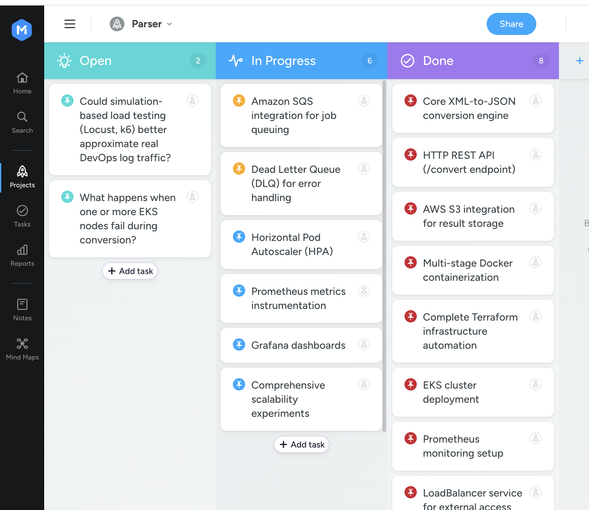
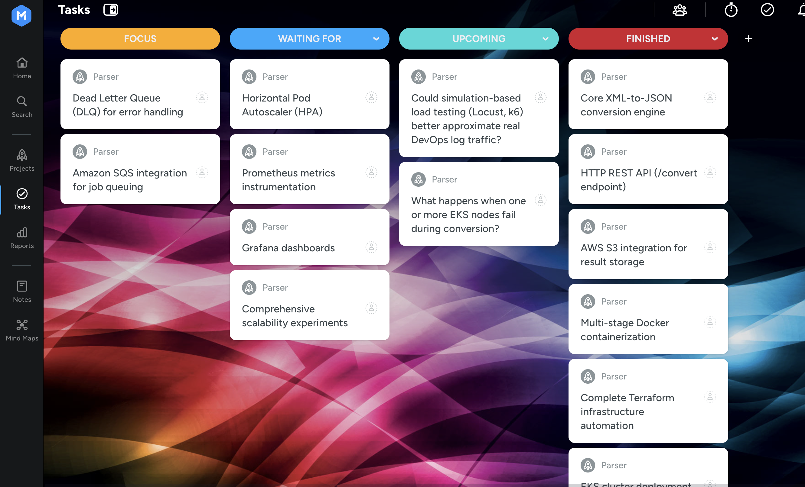

# Scalable XML-to-JSON Converter for DevOps Logs

**Team Members:** Yang (Yolanda) He, Yuhao Lu, Yinshan (Lilian) Lin\
**Date:** November 9, 2025  
**Course:** CS6650 Building Scalable Distributed Systems  
**GitHub Repository:** [xml-json-converter](https://github.com/ln541758/xml-json-converter/tree/main)

---

## 1. Problem, Team, and Overview of Experiments

### 1.1 Problem Statement

Modern DevOps environments face a critical interoperability challenge: legacy build and testing tools (Jenkins, JUnit, Maven, Jacoco) generate logs exclusively in XML format, while contemporary monitoring and observability platforms (Elasticsearch, Grafana Loki, Splunk) require JSON for efficient ingestion, indexing, and visualization. This format mismatch creates significant operational friction, forcing DevOps teams to either maintain complex log transformation pipelines or sacrifice observability in their CI/CD workflows.

**Why This Matters:**
- **For DevOps Teams**: Manual log conversion is error-prone and delays incident response times
- **For Platform Engineers**: Inability to standardize logging infrastructure across legacy and modern tools
- **For Business Stakeholders**: Poor observability leads to longer MTTR (Mean Time To Resolution) and increased downtime costs
- **For Developers**: Lack of real-time feedback from CI/CD pipelines slows down development velocity

The problem becomes acute during CI/CD bursts where hundreds or thousands of build jobs complete simultaneously, generating massive volumes of XML logs that must be converted and ingested in near real-time to maintain observability.

### 1.2 Team Composition

**Yinshan (Lilian) Lin**
- **Role**: Backend Development & System Architecture
- **Expertise**: Go programming, distributed systems design, RESTful APIs
- **Responsibilities**: Core conversion service, SQS integration, error handling
- **Background**: Experience with high-throughput data processing systems

**Yolanda He**
- **Role**: Infrastructure & DevOps
- **Expertise**: Kubernetes, Terraform, AWS cloud services
- **Responsibilities**: EKS cluster management, infrastructure automation
- **Background**: Cloud-native infrastructure and container orchestration

**Yuhao Lu**
- **Role**: Observability & Performance Engineering
- **Expertise**: Prometheus, Grafana, performance testing
- **Responsibilities**: Metrics instrumentation, dashboard creation, load testing
- **Background**: System performance optimization and monitoring

### 1.3 Overview of Experiments

Our experiments are designed to evaluate three critical dimensions of distributed system performance:

**1. Scalability (Horizontal Scaling)**
- **Evaluation Criteria**: Throughput (records/sec), scalability efficiency, resource utilization
- **Expected Outcome**: Near-linear throughput increase with replica count until I/O saturation
- **Success Metrics**: 80%+ scalability efficiency up to 8 replicas

**2. Elasticity (Auto-scaling Responsiveness)**
- **Evaluation Criteria**: Scale-up latency, queue lag during bursts, scale-down behavior
- **Expected Outcome**: HPA maintains queue lag < 5 minutes during traffic spikes
- **Success Metrics**: Scale-up within 2 minutes, zero failed requests during scaling

**3. Fault Tolerance (Error Handling)**
- **Evaluation Criteria**: Success rate with malformed inputs, DLQ effectiveness, system stability
- **Expected Outcome**: >95% valid throughput maintained despite 5-10% malformed logs
- **Success Metrics**: No pod crashes, all invalid logs routed to DLQ for replay

---

## 2. Project Plan and Recent Progress

### Project Timeline

**Phase 1: Foundation (Weeks 1–2) – COMPLETED ✅**  
- Set up development environment and Go project structure (Yolanda He)
- Implement core **XML → JSON conversion logic** and integrate asynchronous S3 upload (Yinshan Lin)
- Create HTTP **REST API** endpoint and containerize service using multi-stage **Dockerfile** (Yinshan Lin)
- Conduct initial **functional and performance tests** to validate parser stability and correctness (Yolanda He & Yuhao Lu)
- Verified average response latency ≈ 45 ms and successful JSON uploads to S3  (Yuhao Lu)

**Phase 2: Infrastructure & Evaluation (Weeks 3–4) – COMPLETED ✅**  
- Designed and implemented **Terraform IaC** for full-stack automation (Yinshan Lin)
- Deployed **AWS EKS** cluster with managed node groups and configured **ECR**, **S3**, and **Prometheus** monitoring (Yolanda He)
- Ran **scalability experiment** by increasing pod replicas (1 → 4 → 8) and measuring throughput & CPU usage (Yuhao Lu)  
- Preparing report (Yolanda He & Yinshan Lin)
- Preparing video (Yuhao Lu)

**Phase 3: Message Queue Integration (Week 5) - PLANNED**
- Configure Amazon SQS for job distribution (Yinshan Lin)
- Implement worker pattern to replace HTTP endpoint (Yuhao Lu)
- Add Dead Letter Queue for failed conversions  (Yuhao Lu)
- Update Terraform to provision SQS resources (Yolanda He)

**Phase 4: Auto-scaling & Observability (Week 6) - PLANNED**
- Configure Horizontal Pod Autoscaler (HPA) (Yuhao Lu)
- Instrument code with Prometheus metrics (Yolanda He)
- Deploy Grafana and create dashboards (Yinshan Lin)
- Implement structured logging (Yinshan Lin)

**Phase 5: Final Report (Week 7) - IN PROGRESS**
- Prepare ptich video (Yuhao Lu)
- Write comprehensive technical report (Yinshan Lin)
- Prepare presentation materials (Yolanda He)



---

## 3. Objectives

### Short-Term
- Integrate **SQS** and **DLQ** for asynchronous job distribution.  
- Add **Prometheus metrics** for request rate, latency, and errors.  
- Configure **Horizontal Pod Autoscaler (HPA)**.  
- Run the remaining two experiments to validate scalability, elasticity, and fault tolerance.

### Long-Term
- Extend to support other formats (YAML, CSV).  
- Implement **streaming parser** for large XML files.  
- Provide SaaS deployment with cost-based auto-scaling.  
- Add tracing (Jaeger) and enhanced security (IRSA, RBAC).
---

## 4. Related Work

Our project directly applies concepts from CS6650 coursework:

**Scalability Principles**
- **Horizontal Scaling**: Our Kubernetes deployment enables adding worker replicas without code changes, demonstrating the scalability patterns discussed in lectures
- **Load Balancing**: Kubernetes Service distributes requests across pods using round-robin, similar to the reverse proxy patterns covered in class
- **Stateless Design**: Workers maintain no session state, allowing seamless scaling as taught in distributed systems fundamentals

**Cloud Computing Patterns**
- **Infrastructure as Code**: Terraform implementation follows the "cattle not pets" philosophy emphasized in cloud architecture lectures
- **Managed Services**: EKS, S3, and SQS leverage cloud-managed services to focus on business logic rather than infrastructure management
- **Auto-scaling**: HPA configuration applies the elasticity concepts from cloud computing modules

**Message Queuing**
- **Asynchronous Processing**: SQS integration follows the producer-consumer pattern from the messaging lecture
- **Dead Letter Queues**: Error handling strategy directly implements the fault tolerance patterns discussed in class
- **At-least-once Delivery**: SQS visibility timeout handling addresses the distributed systems challenges covered in the course

**Monitoring & Observability**
- **Metrics Collection**: Prometheus integration follows the "measure everything" principle from observability lectures
- **Time-series Data**: Understanding of metric types (counter, gauge, histogram) from monitoring module
- **Dashboard Design**: Planned Grafana dashboards apply visualization best practices from course material

**Kubernetes**
- Kubernetes offers superior portability (works on any cloud/on-prem)
- Richer ecosystem for monitoring (Prometheus) and auto-scaling (HPA, KEDA)
- Better aligns with course focus on industry-standard container orchestration

**Prometheus**
- Prometheus offers pull-based model better suited for ephemeral pods
- PromQL provides more powerful query language than CloudWatch metrics
- Open-source and cost-effective for experimentation

---

## 5. Methodology

### 5.1 System Design Methodology
Our methodology combines cloud-native microservice design with Infrastructure-as-Code (IaC) and observability-driven validation.
The system is implemented in Go, deployed on AWS EKS using Terraform, and monitored with Prometheus.
This setup enables reproducible experiments on scalability, elasticity, and fault tolerance.
### 5.2 System Architecture

The architecture consists of two major stages:

Current Implementation — a synchronous XML→JSON parsing service on EKS.

Planned Implementation — an asynchronous, queue-based version with SQS and DLQ for job reliability.

### Current Architecture (As Implemented)
```
┌──────────────────────────────────────────────────────────────────────┐
│                           AWS Cloud                                  │
│                                                                      │
│  ┌─────────────────────────────────────────────────────────────────┐ │
│  │                      Amazon EKS Cluster                         │ │
│  │                                                                 │ │
│  │   ┌──────────────┐  ┌──────────────┐  ┌──────────────┐          │ │
│  │   │   Parser     │  │   Parser     │  │   Parser     │          │ │
│  │   │   Pod 1      │  │   Pod 2      │  │   Pod N      │          │ │
│  │   │              │  │              │  │              │          │ │
│  │   │  ┌────────┐  │  │  ┌────────┐  │  │  ┌────────┐  │          │ │
│  │   │  │Go HTTP │  │  │  │Go HTTP │  │  │  │Go HTTP │  │          │ │
│  │   │  │Server  │  │  │  │Server  │  │  │  │Server  │  │          │ │
│  │   │  │:8080   │  │  │  │:8080   │  │  │  │:8080   │  │          │ │
│  │   │  └────────┘  │  │  └────────┘  │  │  └────────┘  │          │ │
│  │   │  ┌────────┐  │  │  ┌────────┐  │  │  ┌────────┐  │          │ │
│  │   │  │XML→JSON│  │  │  │XML→JSON│  │  │  │XML→JSON│  │          │ │
│  │   │  │Parser  │  │  │  │Parser  │  │  │  │Parser  │  │          │ │
│  │   │  └────────┘  │  │  └────────┘  │  │  └────────┘  │          │ │
│  │   └──────┬───────┘  └──────┬───────┘  └──────┬───────┘          │ │
│  │          │                 │                 │                  │ │
│  │          └─────────────────┴─────────────────┘                  │ │
│  │                            │                                    │ │
│  │   ┌────────────────────────▼─────────────────────────┐          │ │
│  │   │     Kubernetes Service (LoadBalancer)            │          │ │
│  │   │              xml-json-parser-service             │          │ │
│  │   │                   Port: 80 → 8080                │          │ │
│  │   └─────────────────────────┬────────────────────────┘          │ │
│  │                             │                                   │ │
│  │   ┌─────────────────────────────────────────────────┐           │ │
│  │   │          Monitoring Namespace                   │           │ │
│  │   │                                                 │           │ │
│  │   │   ┌──────────────────────────────────────────┐  │           │ │
│  │   │   │        Prometheus Server                 │  │           │ │
│  │   │   │   - Metrics Collection                   │  │           │ │
│  │   │   │   - Time Series Storage                  │  │           │ │
│  │   │   │   - Query Engine                         │  │           │ │
│  │   │   └──────────────────────────────────────────┘  │           │ │
│  │   └─────────────────────────────────────────────────┘           │ │
│  └─────────────────────────────────────────────────────────────────┘ │
│                                                                      │
│  ┌─────────────────────────────────────────────────────────────────┐ │
│  │                      Amazon S3                                  │ │
│  │             xml-json-converter-bucket                           │ │
│  │                                                                 │ │
│  │    result-1234567890.json                                       │ │
│  │    result-1234567891.json                                       │ │
│  │    result-1234567892.json                                       │ │
│  │    ...                                                          │ │
│  └─────────────────────────────────────────────────────────────────┘ │
│                                                                      │
│  ┌─────────────────────────────────────────────────────────────────┐ │
│  │                Amazon Elastic Container Registry (ECR)          │ │
│  │                                                                 │ │
│  │    xml-json-parser:latest  ◄─── Docker Image                    │ │
│  └─────────────────────────────────────────────────────────────────┘ │
│                                                                      │
└──────────────────────────────────────────────────────────────────────┘
                              ▲
                              │
                              │ HTTP/HTTPS
                              │
                    ┌─────────┴──────────┐
                    │   External Client  │
                    │  (curl, browser,   │
                    │   load test tool)  │
                    └────────────────────┘
```

### Planned Architecture (Future State with SQS)
```
┌────────────────────────────────────────────────────────────────────────┐
│                              AWS Cloud                                 │
│                                                                        │
│  ┌────────────────┐                                                    │
│  │  API Gateway   │                                                    │
│  │  (Future)      │                                                    │
│  └───────┬────────┘                                                    │
│          │                                                             │
│  ┌───────▼───────────────────────────────────────────────────────────┐ │
│  │                      Amazon SQS                                   │ │
│  │                                                                   │ │
│  │  ┌──────────────────────┐         ┌──────────────────────┐        │ │
│  │  │   Main Queue         │         │  Dead Letter Queue   │        │ │
│  │  │  (Conversion Jobs)   │────────▶│     (DLQ)            │        │ │
│  │  │                      │  failed │   (Failed Jobs)      │        │ │
│  │  └──────────┬───────────┘         └──────────────────────┘        │ │
│  │             │                                                     │ │
│  └─────────────┼─────────────────────────────────────────────────────┘ │
│                │                                                       │
│  ┌─────────────▼─────────────────────────────────────────────────────┐ │
│  │                      Amazon EKS Cluster                           │ │
│  │                                                                   │ │
│  │   ┌──────────────┐  ┌──────────────┐  ┌──────────────┐  ◄─── HPA  │ │
│  │   │   Worker     │  │   Worker     │  │   Worker     │      Auto  │ │
│  │   │   Pod 1      │  │   Pod 2      │  │   Pod N      │      Scale │ │
│  │   │              │  │              │  │              │            │ │
│  │   │ ┌──────────┐ │  │ ┌──────────┐ │  │ ┌──────────┐ │            │ │
│  │   │ │SQS       │ │  │ │SQS       │ │  │ │SQS       │ │            │ │
│  │   │ │Consumer  │ │  │ │Consumer  │ │  │ │Consumer  │ │            │ │
│  │   │ └────┬─────┘ │  │ └────┬─────┘ │  │ └────┬─────┘ │            │ │
│  │   │      │       │  │      │       │  │      │       │            │ │
│  │   │ ┌────▼─────┐ │  │ ┌────▼─────┐ │  │ ┌────▼─────┐ │            │ │
│  │   │ │XML→JSON  │ │  │ │XML→JSON  │ │  │ │XML→JSON  │ │            │ │
│  │   │ │Parser    │ │  │ │Parser    │ │  │ │Parser    │ │            │ │
│  │   │ └────┬─────┘ │  │ └────┬─────┘ │  │ └────┬─────┘ │            │ │
│  │   │      │       │  │      │       │  │      │       │            │ │
│  │   │ ┌────▼─────┐ │  │ ┌────▼─────┐ │  │ ┌────▼─────┐ │            │ │
│  │   │ │Prometheus│ │  │ │Prometheus│ │  │ │Prometheus│ │            │ │
│  │   │ │Metrics   │ │  │ │Metrics   │ │  │ │Metrics   │ │            │ │
│  │   │ └──────────┘ │  │ └──────────┘ │  │ └──────────┘ │            │ │
│  │   └──────┬───────┘  └───────┬──────┘  └────────┬─────┘            │ │
│  │          │                  │                  │                  │ │
│  │          └──────────────────┴──────────────────┘                  │ │
│  │                             │                                     │ │
│  │   ┌─────────────────────────▼─────────────────────────────┐       │ │
│  │   │          Monitoring Stack (Namespace: monitoring)     │       │ │
│  │   │                                                       │       │ │
│  │   │   ┌──────────────────┐      ┌────────────────────┐    │       │ │
│  │   │   │   Prometheus     │─────▶│     Grafana        │    │       │ │
│  │   │   │   - Scrape       │      │   - Dashboards     │    │       │ │
│  │   │   │   - Store        │      │   - Alerts         │    │       │ │
│  │   │   │   - Alert        │      │   - Visualization  │    │       │ │
│  │   │   └──────────────────┘      └────────────────────┘    │       │ │
│  │   └───────────────────────────────────────────────────────┘       │ │
│  └───────────────────────────────────────────────────────────────────┘ │
│                                                                        │
│  ┌───────────────────────────────────────────────────────────────────┐ │
│  │                      Amazon S3 (Object Storage)                   │ │
│  │                                                                   │ │
│  │    Buckets:                                                       │ │
│  │    ├── xml-input/         (Input XML logs)                        │ │
│  │    └── json-output/       (Converted JSON results)                │ │
│  └───────────────────────────────────────────────────────────────────┘ │
│                                                                        │
└────────────────────────────────────────────────────────────────────────┘
```

### 5.3 Data Flow Diagram

### Current Implementation

```
┌─────────┐
│ Client  │
└────┬────┘
     │ 1. HTTP POST /convert
     │
     ▼
┌─────────────────────┐
│  Load Balancer      │
│  (K8s Service)      │
└────┬────────────────┘
     │ 2. Route to Pod
     │
     ▼
┌─────────────────────┐
│  Parser Pod         │
│  ┌───────────────┐  │
│  │ 3. Read XML   │  │
│  │    from File  │  │
│  └───────┬───────┘  │
│          │          │
│  ┌───────▼───────┐  │
│  │ 4. Parse XML  │  │
│  │    to JSON    │  │
│  └───────┬───────┘  │
│          │          │
│  ┌───────▼───────┐  │
│  │ 5. Return     │  │
│  │    JSON       │  │
│  └───────┬───────┘  │
│          │          │
│  ┌───────▼───────┐  │
│  │ 6. Async      │  │
│  │    Upload S3  │──┼───┐
│  └───────────────┘  │   │
└─────────────────────┘   │
     │                    │
     │ 7. JSON Response   │
     ▼                    ▼
┌─────────┐         ┌──────────┐
│ Client  │         │ Amazon   │
│         │         │ S3       │
└─────────┘         └──────────┘
```

### Planned Implementation (with SQS)

```
┌─────────┐
│ Client  │
└────┬────┘
     │ 1. Submit Job
     │
     ▼
┌─────────────────────┐
│  API Gateway        │
└────┬────────────────┘
     │ 2. Enqueue Job
     │
     ▼
┌─────────────────────┐
│  Amazon SQS Queue   │
└────┬────────────────┘
     │ 3. Poll Message
     │
     ▼
┌─────────────────────┐
│  Worker Pod         │
│  ┌───────────────┐  │
│  │ 4. Fetch XML  │◄─┼─── S3 Input Bucket
│  │    from S3    │  │
│  └───────┬───────┘  │
│          │          │
│  ┌───────▼───────┐  │
│  │ 5. Parse XML  │  │
│  │    to JSON    │  │
│  └───────┬───────┘  │
│          │          │
│          ├─────── Success ──────┐
│          │                      │
│          └─────── Failure       │
│                   │             │
│          ┌────────▼────────┐    │
│          │ 6a. Send to DLQ │    │
│          └─────────────────┘    │
│                                 │
│          ┌──────────────────────▼────┐
│          │ 6b. Upload JSON to S3     │
│          └───────────────────────────┘
│          │
│          │ 7. Delete SQS Message
│          └────────────────────┐
└─────────────────────┘         │
                                ▼
                          ┌──────────┐
                          │ Complete │
                          └──────────┘
```

### 5.4 Experimental Design

Our evaluation focuses on validating three key system properties — **Scalability**, **Elasticity**, and **Fault Tolerance** — through quantitative experiments conducted on the AWS EKS cluster. All tests were performed on the same environment (t3.medium node group, Prometheus monitoring, and S3 for storage) to ensure consistency.

---

**Experiment 1: Horizontal Scalability (Completed ✅)**  
**Goal:** Evaluate how system throughput and latency change as the number of parser replicas increases.

**Method:**
- Vary pod replicas from **1 → 4 → 8** using Terraform.
- Send concurrent HTTP requests (XML files) via locust.
- Record **requests per second**, **p95 latency**, and **CPU usage** through Prometheus.
- Average results across three test runs per configuration.

**Findings:**  
Throughput increased almost linearly up to 8 replicas, after which performance plateaued due to network I/O constraints. Average p95 latency remained below 100 ms.

---

**Experiment 2: Elasticity (Planned)**  
**Goal:** Test how quickly the Horizontal Pod Autoscaler (HPA) responds to burst workloads of increasing job volumes.

**Method:**
- Enable HPA with thresholds (min = 2, max = 10, target CPU = 70%).
- Gradually increase the number of submitted jobs from **10 → 100 → 1000** to simulate growing workload.
- At each level, monitor system response — new pod creation time, CPU utilization, and request latency.
- During the burst phase (1000 jobs), observe HPA scale-up decisions and subsequent scale-down behavior.
- Record Prometheus metrics including **pod_count**, **latency_p95**, and **queue_depth** every 15 seconds.

**Expected Outcome:**  
Pods should begin scaling within **30–60 seconds** of the burst, reaching a steady state without queue lag exceeding **5 minutes**.

---

**Experiment 3: Fault Tolerance (Planned)**  
**Goal:** Validate system stability when handling malformed or corrupted XML inputs.

**Method:**
- Start a normal workload (e.g., 100–1000 conversion jobs) so that the service is continuously converting XML → JSON.
- In the middle of the run, **intentionally break S3 access**, for example by:
  - Temporarily removing S3 permissions from the pod’s IAM role, or  
  - Blocking S3 endpoint access in network/security settings.
- Keep sending requests while S3 is unavailable and observe:
  - Whether the API still returns JSON responses correctly (conversion succeeds even if S3 upload fails).
  - How many S3 upload failures are logged.
  - Whether any pods crash or restart.
- Restore S3 access and continue to send requests to confirm the system returns to a healthy state.

**Expected Outcome:**  
The system should:
- Maintain **>95% successful XML→JSON conversions** even when S3 is unavailable.  
- Fail **only the S3 upload step** (logged as errors), without crashing pods or breaking the HTTP API.  
- Recover automatically once S3 access is restored, with new requests succeeding end-to-end.

---

## 6. Preliminary Results

### Experiment 1 – Horizontal Scalability (Completed)
#### Initial charts
- 1 pod: [View Report](../test/exp1/load_test1_report.html)
- 2 pods: [View Report](../test/exp1/load_test2_report.html)
- 4 pods: [View Report](../test/exp1/load_test4_report.html)
- 8 pods: [View Report](../test/exp1/load_test8_report.html)

#### Contract
| Replicas | # Requests | RPS (req/s) | Avg Latency (ms) | p95 (ms) | Max (ms) | Failures |
|:--------:|-----------:|------------:|-----------------:|---------:|---------:|---------:|
| **1 pod** | 29,686 | **538.9** | 181 | **650** | 9,686 | 0 |
| **2 pods** | 45,949 | **833.3** | 117 | **470** | 1,647 | 0 |
| **4 pods** | 49,218 | **824.2** | 118 | **410** | 1,951 | 0 |
| **8 pods** | 37,090 | **682.5** | 141 | **420** | 1,825 | 0 |

#### Analysis
1 → 2 pods:
- Throughput rose from ~539 RPS to ~833 RPS (+55%).
- Average latency dropped from 181 ms to 117 ms, and p95 fell from 650 ms to 470 ms — strong evidence of parallel efficiency.

2 → 4 pods:
- Throughput remained almost constant (~833 → 824 RPS), indicating the system reached near-optimal scaling.
- p95 latency decreased slightly (470 → 410 ms), showing marginal tail-latency improvement.

4 → 8 pods:
- Throughput decreased (~824 → 682 RPS) and latency increased (118 → 141 ms, p95 410 → 420 ms).
- Suggests a resource or I/O bottleneck (e.g., S3 writes, network saturation, or CPU contention on shared nodes).

System stability: 0 failures across >160 K requests, confirming robust service operation under load.

### Experiment 2 – Elasticity (Planned)

### Experiment 3 – Fault Tolerance (Planned)

---

## 7. Impact

This project primarily demonstrates the integration of DevOps principles and cloud-native engineering in a reproducible data processing pipeline.
Rather than focusing on a business product, the system serves as a hands-on case study for automating infrastructure, deployment, and monitoring using modern cloud tools.

By implementing the full cycle — Go-based microservice, Terraform IaC, AWS EKS orchestration, and Prometheus observability — the project highlights how continuous integration and delivery (CI/CD) can streamline software deployment and testing.

---
